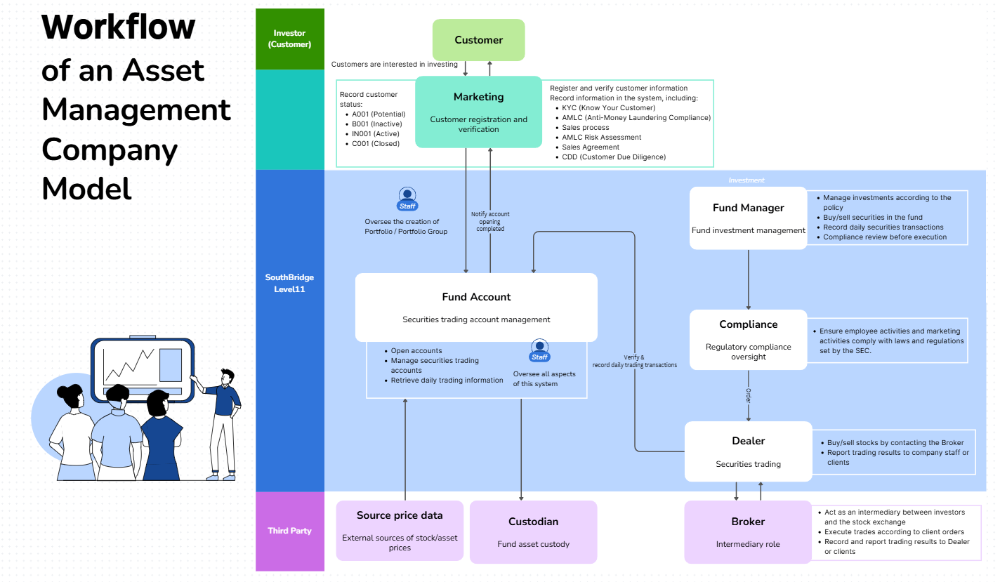

# Sample Workflow  of an Asset Management Company

This diagram illustrates the Workflow of an Asset Management Company Model, specifically highlighting the integrated role of SouthBridge in managing operational processes.

The workflow is divided into three primary levels:

<figure><figcaption></figcaption></figure>



### Investor (Customer)

The journey begins with the Customer interacting with Marketing for registration and verification, which includes mandatory checks such as KYC, AMLC, and CDD to record customer status.



### SouthBridge Level 11

This central operational core manages the Fund Account and Fund Investment Management. It handles account openings, securities trading management, and daily information retrieval. Key roles within this level include:

* Fund Manager: Manages investments, executes trades, and ensures compliance reviews.
* Compliance: Provides regulatory oversight to ensure all activities align with SEC laws and regulations.
* Dealer: Facilitates securities trading by coordinating with brokers and reporting results.



### Third Party

SouthBridge interacts with external entities, including Source Price Data for asset pricing, the Custodian for fund asset custody, and the Broker who acts as an intermediary for executing stock exchange trades.



