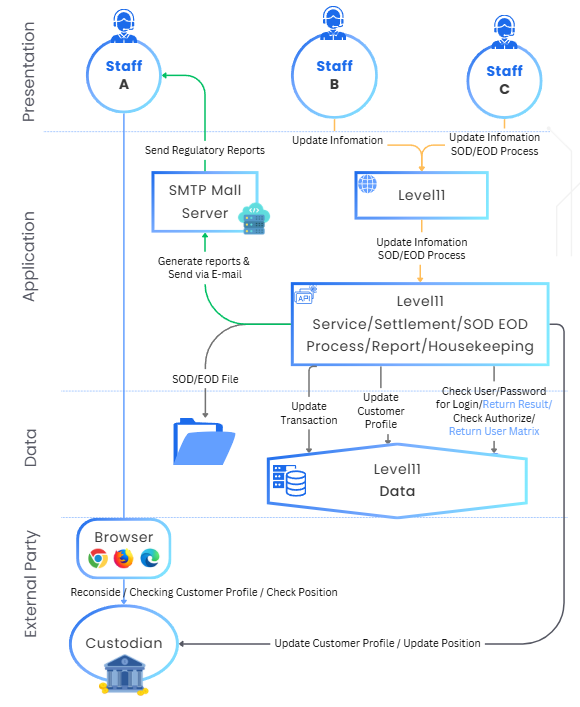

# SouthBridge System

Southbridge documentation for Admin/IT person. Dive right into the documentation by clicking “SouthBridge Docs” button.

<a href="https://docs.southbridge.finance/docs/getting-started/" class="button primary" data-icon="arrow-up-right-from-square">SouthBridge Docs</a>

## SouthBridge System Specification

### Server Requirements

(Minimum Specification)

| Component         | Requirement                                |
| ----------------- | ------------------------------------------ |
| Operating System  | Linux based system (Kernel 3.10 or higher) |
| Processor         | 64-bit Intel Core i3                       |
| Memory (RAM)      | 8 GB                                       |
| Storage           | 128 GiB available space                    |
| Network Interface | 1000 Mb (Gigabit Ethernet)                 |
| Database (DBMS)   | PostgreSQL 16                              |

### Client requirements

Any computer that can reach the server through a Chromium-based browser (Chromium, Chrome, Microsoft Edge, Brave, Opera) — Firefox and Safari are also supported.

***

### Technology Stack

| Technology                   | Developed by          |
| ---------------------------- | --------------------- |
| Server Engine                | Golang                |
| Web application              | React framework       |
| Application Containerization | Docker                |
| Email Service                | Postmark              |
| PDF Rendering                | Chromium docker image |

***

### Deployment

The Southbridge system builds a Docker image of the application and tags it with a hash (for example app:57a51a7f9ac665243b8ab71d02adaca605c28eb7). Clients deploy the image with Docker Compose for efficient configuration management.

**CI / CD**

When a new version is released, the company provides the image name; clients deploy the new image as required.

***

### Maintenance

**Monitor**

The Southbridge system is continuously monitored. If an error occurs the system automatically reports it (an internet connection is required). After every update a changelog report is generated and provided.

**Backup**

You can back up the PostgreSQL database in two ways:

* Run a command-line script provided by the company.
* Run the backup process from the web application — available to users with the IT role.

**Restore**

You can restore the PostgreSQL database in two ways:

* Run a command-line script provided by the company.
* Run the restore process from the web application — available to users with the IT role.

**Restart**

You can restart the application in two ways:

* Run “docker compose restart”.
* Run the restart process from the web application — available to users with the IT role.

***

### System & Network diagram

<figure><figcaption></figcaption></figure>

