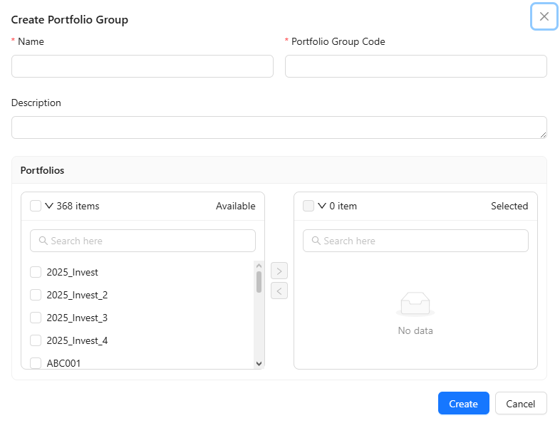

# New Portfolio —

### Create the Portfolio



#### Navigate to Resources ▸ Portfolio ▸ Portfolio.&#x20;

Click <a class="button secondary">Create Portfolio</a> to create a new portfolio.

<figure><figcaption></figcaption></figure>




#### Click <a class="button secondary">Create</a>, after entering the required details.

<figure><figcaption></figcaption></figure>


Set the **Issuer Par** (Initial Face Value) as your starting point (Standard: **10.00**).&#x20;

This value defines how your capital is converted into units on Day 1 and cannot be modified once the portfolio is active.




#### Review and <a class="button secondary">Prove</a>

<figure><figcaption></figcaption></figure>




### Add to Portfolio Group



#### Navigate to Resources ▸ Portfolio ▸ Portfolio Group

<figure><figcaption></figcaption></figure>

Click <a class="button secondary">Create Portfolio Group</a> to create a new one.

Add details and the portfolio to the Portfolio Group.

<figure><figcaption></figcaption></figure>

#### In case, the relevant Portfolio Group is available.

Click  to edit/update the Portfolio Group.

<figure><figcaption></figcaption></figure>

Move the new portfolio to the right side.

<figure><figcaption></figcaption></figure>




#### Click <a class="button secondary">Create</a> or <a class="button secondary">Update</a>

<figure><figcaption></figcaption></figure> <figure><figcaption></figcaption></figure>




#### Review and <a class="button secondary">Prove</a>

<figure><figcaption></figcaption></figure>




### Add to Portfolio Model&#x20;



#### Navigate to Resources ▸ Portfolio ▸ Portfolio Model

<figure><figcaption></figcaption></figure>

Click <a class="button secondary">Create Portfolio Model</a> to create a new one.

Add details and the portfolio to the Portfolio Model.

<figure><figcaption></figcaption></figure>

#### In case, the relevant Portfolio Model is available.

Click  to edit/update the Portfolio Model.

<figure><figcaption></figcaption></figure>

Move the new portfolio to the right side.

<figure><figcaption></figcaption></figure>




#### Click <a class="button secondary">Create</a> or <a class="button secondary">Update</a>

<figure><figcaption></figcaption></figure> <figure><figcaption></figcaption></figure>




#### Review and <a class="button secondary">Prove</a>

<figure><figcaption></figcaption></figure>




### Create **Fee Account Code. (**&#x46;irst-time Onl&#x79;**)**



#### Navigate to Resources ▸ Portfolio ▸ Fee Account Code

Click <a class="button secondary">Create new Fee Account Code</a>to create a new Fee Account Code.

<figure><figcaption></figcaption></figure>




#### Click <a class="button secondary">Create</a>, after entering the required details.

<figure><figcaption></figcaption></figure>




#### Review and <a class="button secondary">Prove</a>




### Create Fee Code (Custodian & Management)



#### Navigate to Resources ▸ Portfolio ▸ Fee Code

Click <a class="button secondary">Create Fee Code</a> to create a new Fee Code.

<figure><figcaption></figcaption></figure>




#### Click <a class="button secondary">Create</a>, after entering the required details.

(Management Fee) , (Custodian Fee)

<figure><figcaption></figcaption></figure> <figure><figcaption></figcaption></figure>




#### Review and <a class="button secondary">Prove</a>

<figure><figcaption></figcaption></figure>


The **Period From** date must align with the **Portfolio's Start Date** to ensure that fee calculations begin correctly from the first day of operation.



Setting the Period From later than the portfolio start date will result in missing fee expenses in your NAV calculation.




### Create the Bank Account



#### Navigate to Resources ▸ Security ▸ Bank Account.&#x20;

Click <a class="button secondary">Create Bank Account</a> to create a new Bank Account.

<figure><figcaption></figcaption></figure>




#### Click <a class="button secondary">Create</a>, after entering the required details.

<figure><figcaption></figcaption></figure>




#### Review and <a class="button secondary">Prove</a>

<figure><figcaption></figcaption></figure>




### Create the Cash Security



#### Navigate to Resources ▸ Security ▸ Cash Security.

Click <a class="button secondary">Create Cash Security</a> to create a new Cash Security.

<figure><figcaption></figcaption></figure>




#### Click <a class="button secondary">Create</a>, after entering the required details.

<figure><figcaption></figcaption></figure>




#### Review and <a class="button secondary">Prove</a>

<figure><figcaption></figcaption></figure>





### Tip: Multi-currency portfolios require a dedicated Bank Account and Cash Security for each currency. Proper mapping between these entities is mandatory for successful automated trading and reporting.

If the portfolio holds multiple currencies for cross-border trading, ensure that a corresponding Bank Account and Cash Security are created for each currency. All components must be correctly linked to ensure accurate multi-currency settlement.


### Create the Main Cash Account



#### Navigate to Resources ▸ Security ▸ Main Cash Account.&#x20;

Click <a class="button secondary">Create Main Cash Account</a> to create a new Main Cash Account.

<figure><figcaption></figcaption></figure>




#### Click <a class="button secondary">Create</a>, after entering the required details.

<figure><figcaption></figcaption></figure>




#### Review and <a class="button secondary">Prove</a>

<figure><figcaption></figcaption></figure>




### Mapping the Portfolio Price Source



#### Navigate to Market ▸ Portfolio Price Source.&#x20;

Click <a class="button secondary">Create Portfolio Price Source</a>to create a new Portfolio Price Source.

<figure><figcaption></figcaption></figure>




#### After add details and the portfolio to the Portfolio Price Source,&#x20;

#### Click <a class="button secondary">Create</a>.

<figure><figcaption></figcaption></figure>

#### In case, the relevant Portfolio Price Source is available.

Click  on an existing Portfolio Price Source to edit/update it.

<figure><figcaption></figcaption></figure>

Move the new portfolio to the right side, and Click <a class="button secondary">Update</a>.

<figure><figcaption></figcaption></figure>




#### Review and <a class="button secondary">Prove</a>

<figure><figcaption></figcaption></figure>




